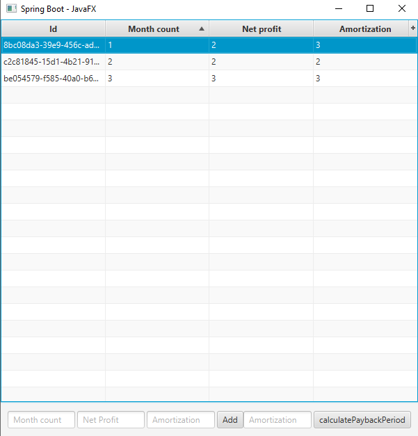
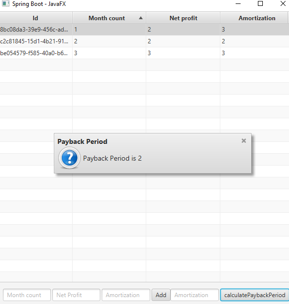

# ПСП задание 2

Разработать GUI-приложение с организацией взаимодействия с БД, реализующее методику оценки привлекательности инвестиционного проекта по методу “Срок окупаемости”

`mvn clean package`

`java -jar target/psp_2-0.0.1-SNAPSHOT.jar`

